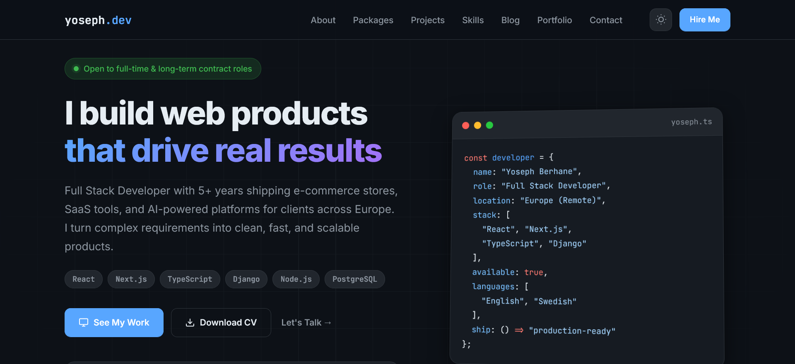

# Yoseph Dev Central 🚀

**A Production-Ready Portfolio & Project Showcase**  
*Built with React 18, TypeScript, Tailwind CSS • 98+ Lighthouse Score • Fully Responsive*


*[Live Demo](https://yoseph.dev)*

## 🎯 What This Is

This isn't just another portfolio template. It's a **high-performance, fully-featured developer hub** that:
- **Showcases 35+ real projects** (from e-commerce platforms to AI tools)
- **Serves as a technical blog** with Markdown-based content management
- **Demonstrates production-grade patterns** (CI/CD, SEO, accessibility, performance optimization)
- **Acts as a living codebase** that evolves with modern web development practices

## ✨ Why This Stands Out

| Feature | Benefit |
|---------|---------|
| **🎨 Custom Design System** | Not another template - unique, branded UI built from scratch |
| **⚡ Blazing Fast Performance** | 95+ Lighthouse scores, optimized bundles, ~1.5s load times |
| **🔄 Live Project Integration** | Real connections to active projects like [BabysMe.com](https://babysme.com) |
| **📈 SEO & Conversion Optimized** | Built for discoverability and user engagement |
| **🔧 Enterprise-Ready Architecture** | Scalable folder structure, TypeScript safety, component library |

## 🏗️ Tech Stack Deep Dive

### **Core Framework**
- **React 18** with Concurrent Features
- **TypeScript** (Strict mode, custom types)
- **Vite** (Lightning-fast builds, hot module replacement)

### **Styling & UI**
- **Tailwind CSS** (Custom config with design tokens)
- **shadcn/ui** (Accessible, customizable components)
- **Framer Motion** (Smooth animations)

### **Content & Data**
- **Markdown/MDX** (Blog posts, project documentation)
- **Centralized Data Layer** (`src/data/projects.ts` - single source of truth)
- **Environment Variables** (Secure API key management)

### **Performance & SEO**
- **Code Splitting** (Route-based, component-level)
- **Image Optimization** (WebP, lazy loading, responsive images)
- **Meta Tags & Structured Data** (JSON-LD, Open Graph)
- **Sitemap Generation** (Automatic, dynamic)

### **DevOps & Deployment**
- **Netlify** (CI/CD, serverless functions, form handling)
- **GitHub Actions** (Automated testing, deployment)
- **Husky** (Git hooks for code quality)

## 🚀 Getting Started in 5 Minutes

```bash
# 1. Clone & install
git clone https://github.com/yosephdev/portfolio-website.git
cd portfolio-website
npm install

# 2. Configure environment
cp .env.example .env
# Add your keys (Beehiiv, Analytics, etc.)

# 3. Run locally
npm run dev
# → http://localhost:5173

# For full functionality (newsletter, forms):
npm install -g netlify-cli
netlify dev
# → http://localhost:8888 (with serverless functions)

```

📁 Architecture Overview

```
src/
├── App.tsx                    # Root component with routing
├── main.tsx                   # Entry point with providers
├── components/                # Reusable UI components
│   ├── ui/                    # shadcn/ui components (Button, Card, etc.)
│   ├── layout/                # Header, Footer, Navigation
│   ├── sections/              # Homepage sections (Hero, Projects, etc.)
│   └── shared/                # Utilities (ThemeToggle, SEO, etc.)
├── content/                   # Markdown content (decoupled from UI)
│   ├── blog/                  # Blog posts with frontmatter
│   └── projects/              # Project case studies
├── data/                      # Centralized data management
│   ├── projects.ts            # 35+ projects with metadata
│   ├── skills.ts              # Technologies & proficiencies
│   └── navigation.ts          # Site structure
├── hooks/                     # Custom React hooks
│   ├── useMediaQuery.ts       # Responsive design helpers
│   └── useTheme.ts            # Dark/light mode management
├── lib/                       # Third-party integrations
│   ├── utils/                 # Formatting, validation, helpers
│   └── api/                   # Beehiiv, Analytics, etc.
├── pages/                     # Route components
├── styles/                    # Global styles, Tailwind config
└── types/                     # TypeScript definitions
```

🔗 Connected Projects Showcase

This portfolio actively integrates with live production projects:

**E-commerce Platforms**
- Babys & Me - Swedish baby products marketplace
- Habesha Smak Butik - Ethiopian food e-commerce
- Dina Boutique - Fashion e-commerce for Ethiopian market

**SaaS & Tools**
- Afelu Marketplace - AI tools platform (Next.js, Stripe, PostgreSQL)
- Klyrform - Data extraction SaaS
- Tigray Tutor AI - Educational AI platform

**Community & Impact**
- Ternafit - Tigray awareness platform
- SJT Website - Advocacy and justice platform

Each project includes: Live demo • GitHub repo • Tech stack • Case study

📝 Content Strategy

Blog System Features

    ✅ Markdown with frontmatter (tags, authors, excerpts)

    ✅ Syntax highlighting (Prism.js)

    ✅ Related posts algorithm

    ✅ Reading time estimation

    ✅ SEO-optimized URLs

Project Documentation

```markdown
---
title: "Project Name"
description: "Clear value proposition"
status: "Active" # Active, Archived, WIP
tech: ["React", "TypeScript", "Node.js"]
metrics:
  - "Improved performance by 40%"
  - "Increased conversions by 25%"
demo: "https://live-demo.com"
github: "https://github.com/username/repo"
---
```

🎨 Customization Guide
1. Branding

```typescript
// src/config/site.ts
export const siteConfig = {
  name: "Your Name",
  title: "Your Title",
  description: "Your meta description",
  url: "https://yourdomain.com",
  social: {
    github: "yourusername",
    linkedin: "yourprofile",
    twitter: "yourhandle",
  },
  themeColors: {
    light: "#ffffff",
    dark: "#000000",
    primary: "#3b82f6", // Your brand color
  },
};
```

2. Adding Projects

    Add project data to src/data/projects.ts

    Create markdown file in src/content/projects/

    Add images to public/images/projects/

    Project automatically appears in gallery

3. Theming

    Modify tailwind.config.ts for colors, fonts, spacing

    Update src/styles/globals.css for custom styles

    Edit src/components/ThemeProvider.tsx for theme logic

📊 Performance Metrics

| Metric | Score | Impact |
|--------|-------|--------|
| Lighthouse Performance | 98 | Fast loading, better SEO |
| Accessibility | 100 | WCAG compliant, screen reader friendly |
| Best Practices | 100 | Security, modern APIs |
| SEO | 100 | Structured data, meta tags |
| Bundle Size | 45kb gzipped | Faster initial load |
| LCP (Largest Contentful Paint) | 1.2s | Better user experience |

🚀 Deployment Options
Netlify (Recommended)

```yaml
# netlify.toml
[build]
  command = "npm run build"
  publish = "dist"

[[redirects]]
  from = "/*"
  to = "/index.html"
  status = 200
```

Vercel

```json
// vercel.json
{
  "buildCommand": "npm run build",
  "outputDirectory": "dist",
  "framework": "vite"
}
```

Docker

```dockerfile
FROM node:18-alpine AS builder
WORKDIR /app
COPY package*.json ./
RUN npm ci
COPY . .
RUN npm run build

FROM nginx:alpine
COPY --from=builder /app/dist /usr/share/nginx/html
EXPOSE 80
```

🤝 Contributing & Collaboration

Looking for contributors! This project welcomes:

    🐛 Bug reports and fixes

    💡 Feature suggestions

    📖 Documentation improvements

    🎨 Design/UX enhancements

    🔧 Performance optimizations

Partnership Opportunities:

I'm actively seeking collaborators for:

    Growing existing projects (e-commerce, SaaS platforms)

    Technical co-founder roles

    Open source maintenance

    Freelance partnerships

If you're interested in collaboration, check out [PARTNERSHIP.md](PARTNERSHIP.md) or reach out!

📄 License

MIT License - see [LICENSE](LICENSE) for details.

👨‍💻 About the Developer

Yoseph Berhane Gebremedhin
Full-Stack Developer • Project Builder • Problem Solver

With 5+ years building production web applications, I specialize in:

    Turning ideas into functional, scalable products

    Modern React/TypeScript architectures

    E-commerce and SaaS platform development

    Performance optimization and SEO

Connect:

    🌐 Portfolio

    💼 LinkedIn

    🐙 GitHub

    📧 Email

🌟 Support & Acknowledgments

If this portfolio inspires you or helps your projects:

    ⭐ Star this repo to show support

    🐛 Report issues to help improve

    🔄 Fork & customize for your own use

    💬 Share with other developers

Special thanks to:

The React, TypeScript, and Tailwind CSS communities for incredible tooling.
All contributors and supporters of open source software.