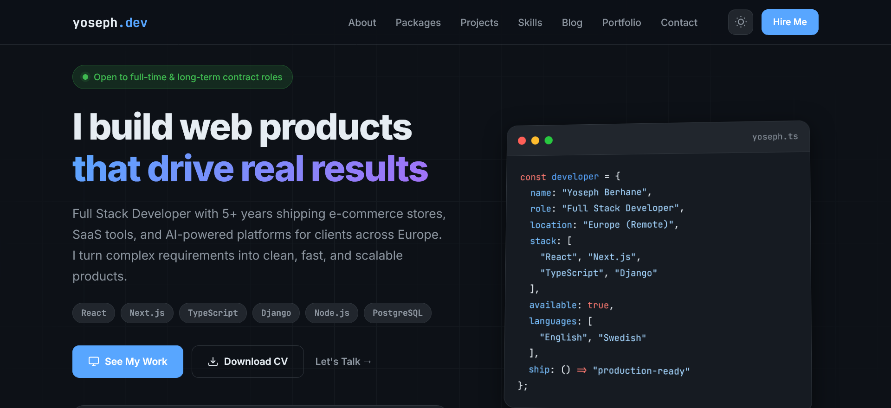

# Yoseph Berhane — Full Stack Developer Portfolio

**Full Stack Developer (React, Next.js, TypeScript, Django) — 5+ Years Shipping Production Web Products**  
*Remote-first · Swedish citizen · EU work rights · Available immediately*



**[Live Portfolio →](https://yoseph.dev)** · **[Contact →](https://yoseph.dev/contact)**

---

## About This Repo

This is the source code for [yoseph.dev](https://yoseph.dev) — a production portfolio and freelance services site. It's a hybrid setup:

- **`public/index.html`** — Static homepage (vanilla HTML/CSS/JS, no build step) served at `/`
- **`src/`** — React/TypeScript SPA (Vite build) served at `/app/*` via Netlify rewrite rules
- **`public/netlify.toml`** — All redirect and rewrite rules (copied into `dist/` at build time)

The static homepage handles the marketing/services content (fast, no JS required), while the React app handles richer pages like `/projects`, `/blog`, `/about`, and `/contact`.

---

## Services (WebNord — Freelance Packages)

I offer three fixed-scope packages through [WebNord](https://yoseph.dev/#packages):

| Package | Price | Scope |
|---------|-------|-------|
| **Starter** | From €299 | 3-page site, mobile-first, deployed within 1 week |
| **Professional** | From €699 | Full website up to 8 pages, CMS, SEO, analytics |
| **Custom** | From €1,499 | E-commerce, SaaS, multi-platform builds |

All packages include: responsive design, Netlify deployment, contact form, and 30-day post-launch support.

---

## Featured Projects

| Project | Type | Stack |
|---------|------|-------|
| **[Klyrform](https://klyrform.com)** | SaaS — data extraction | Next.js · TypeScript · PostgreSQL · AI APIs |
| **[Afelu.com](https://afelu.com)** | AI tools marketplace | Next.js · TypeScript · Stripe · PostgreSQL |
| **[TernaFit](https://ternafit.org)** | Nonprofit (3 platforms) | React · Next.js · TypeScript · PostgreSQL · Netlify |
| **[Baby's & Me](https://babysme.com)** | E-commerce | Vite · React · TypeScript · shadcn/ui |
| **[Selam's Handmade](https://selamshandmade.com)** | E-commerce (25% sales lift) | React · Next.js · Stripe |
| **[Habesha Smak Butik](https://habeshasmak.store)** | Multilingual e-commerce | React · TypeScript · PostgreSQL · Stripe |
| **[MT Butik](https://mtbutik.se)** | Business website | Vite · React · TypeScript · Tailwind |
| **Cascadia Transport Services** | Booking platform | React · Next.js · TypeScript |
| **Super Merra Frisör** | Salon + booking | React · Next.js · TypeScript |
| **Enjera Restaurant** | Restaurant website | React · Next.js · TypeScript |

27 projects total — see the full list at [yoseph.dev/app/projects](https://yoseph.dev/app/projects).

---

## Tech Stack

### Core
- **React 18** + **TypeScript** (strict mode)
- **Next.js 14** for full-stack and SSR projects
- **Vite** for fast SPA builds (this portfolio)

### Styling & UI
- **Tailwind CSS** with custom design tokens
- **shadcn/ui** — accessible, composable components
- Vanilla CSS for the static homepage (dark-mode-first, no framework)

### Backend & Data
- **Node.js** / **Django** for API and server logic
- **PostgreSQL** (primary database for most projects)
- **Redis** for caching (EcoPaws, Klyrform)
- **Prisma** ORM

### Payments & Integrations
- **Stripe** — subscriptions, one-time payments, marketplace splits
- **Klarna** — buy-now-pay-later for Swedish e-commerce
- **OpenAI / AI APIs** — Klyrform, Tigray Tutor AI, Afelu
- **Google Maps API** — LimoFlow, StaySwift

### DevOps & Deployment
- **Netlify** — CI/CD, serverless functions, form handling, redirects
- **Vercel** — Next.js projects
- **Docker** — local dev environments and production containers
- **GitHub Actions** — automated tests and deployment pipelines

---

## Project Structure

```
portfolio-website/
├── public/                    # Static homepage (no build step)
│   ├── index.html             # Main homepage + services + projects
│   ├── styles.css             # Dark-mode-first stylesheet
│   ├── script.js              # Vanilla JS (carousel, theme, form)
│   ├── netlify.toml           # Routing rules (copied to dist/ at build)
│   ├── images/                # Project previews + assets
│   └── downloads/             # Free resources (cheatsheets, etc.)
├── src/                       # React/TypeScript SPA
│   ├── App.tsx                # Root with BrowserRouter (basename="/app")
│   ├── pages/
│   │   ├── Index.tsx          # React homepage (redirects to static /)
│   │   ├── Projects.tsx       # Filterable project gallery
│   │   ├── About.tsx          # Bio, skills, testimonials, GitHub stats
│   │   ├── Blog.tsx / BlogPost.tsx
│   │   ├── Contact.tsx        # Contact form (Netlify Forms)
│   │   └── Resources.tsx
│   ├── components/
│   │   ├── Header.tsx / Footer.tsx
│   │   ├── ProjectCard.tsx    # Used in Projects page
│   │   ├── Testimonials.tsx   # 9 unique client/instructor testimonials
│   │   ├── ContactForm.tsx    # Netlify Forms AJAX submission
│   │   ├── TechnicalSkills.tsx
│   │   ├── GitHubStats.tsx / GitHubRepos.tsx
│   │   └── JobSeekingBanner.tsx
│   ├── data/
│   │   └── projects.ts        # 27 projects — single source of truth
│   ├── lib/
│   │   └── blogData.ts
│   └── types/
│       └── project.ts
├── app.html                   # SPA entry point (served at /app/*)
├── vite.config.ts
├── tailwind.config.ts
└── package.json
```

---

## Running Locally

```bash
# Install dependencies
npm install

# Start Vite dev server (React SPA at http://localhost:5173)
npm run dev

# For full Netlify routing + form handling:
npm install -g netlify-cli
netlify dev
# → http://localhost:8888
```

The static homepage (`public/index.html`) is served directly from `dist/` by Netlify. During local dev, open it directly from the `public/` folder or via `netlify dev`.

---

## Contact Form Setup

Contact forms use **Netlify Forms** (no API keys required):

- Static form: `name="contact"` in `public/index.html` with `data-netlify="true"`
- React form: `name="contact-app"` in `app.html` (hidden detection form) + AJAX POST in `ContactForm.tsx`
- Both submit to Netlify's built-in endpoint and appear in the Forms dashboard

---

## Routing Architecture

All routes are defined in `public/netlify.toml` (which Netlify copies to `dist/`):

```toml
# React SPA rewrites
/app       → /app.html (200)
/app/*     → /app.html (200)

# Friendly short URLs redirect to React app
/blog      → /app/blog (301)
/projects  → /app/projects (301)
/about     → /app/about (301)
/contact   → /app/contact (301)
/resources → /app/resources (301)
```

The root `netlify.toml` is intentionally empty for redirects — only `dist/netlify.toml` is read by Netlify at runtime.

---

## Deployment

The site is deployed on **Netlify**. Every push to `main` triggers a build:

```
npm run build   →   dist/
```

The `dist/` directory contains both the compiled React app and the static homepage assets. Netlify reads `dist/netlify.toml` for all routing rules.

---

## License

MIT — feel free to fork and adapt for your own portfolio.

---

*Yoseph Berhane · [yoseph.dev](https://yoseph.dev) · [contact@yoseph.dev](mailto:contact@yoseph.dev)*
