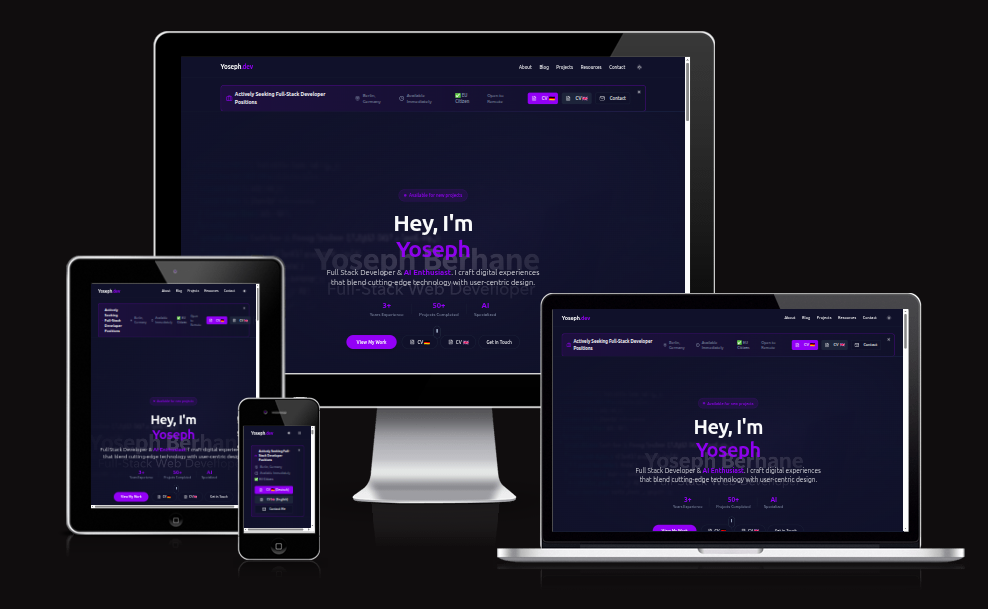

# Portfolio Website

A modern, responsive portfolio website to showcase my projects, blog posts, and professional information. Built with React, TypeScript, Tailwind CSS, and shadcn-ui.



---

## Features

- 🌐 **Responsive Design**: Looks great on desktop, tablet, and mobile devices.
- 🌓 **Dark/Light Mode**: Toggle between light and dark themes.
- 📝 **Blog Section**: Write and display blog posts with Markdown support.
- 💼 **Projects Showcase**: Highlight featured and recent projects with details and screenshots.
- 📬 **Contact Form**: Easy way for visitors to reach out.
- 📰 **Newsletter Signup**: Collect emails for updates.
- 🔍 **Search & Filter**: Quickly find projects or blog posts.
- ⚡ **Fast & Optimized**: Built with Vite for instant reloads and optimized builds.
- 🛠️ **Admin Integration**: Netlify CMS for easy content management (optional).

---

## Technologies Used

- [React](https://react.dev/) & [TypeScript](https://www.typescriptlang.org/)
- [Vite](https://vitejs.dev/) (build tool)
- [Tailwind CSS](https://tailwindcss.com/) (utility-first styling)
- [shadcn/ui](https://ui.shadcn.com/) (UI components)
- [React Router](https://reactrouter.com/) (routing)
- [Netlify CMS](https://www.netlifycms.org/) (content management)
- [Marked.js](https://marked.js.org/) (Markdown rendering)
- [PostCSS](https://postcss.org/) (CSS processing)
- [ESLint](https://eslint.org/) & [Prettier](https://prettier.io/) (code quality)
- [GitHub Actions](https://github.com/features/actions) (CI/CD)
- [Vercel](https://vercel.com/) or [Netlify](https://www.netlify.com/) (deployment)

---

## Installation

1. **Clone the repository:**

   ```sh
   git clone https://github.com/YosephDev/yoseph-dev-central.git

   cd yoseph-dev-central
   ```

2. **Install dependencies:**

   ```sh
   npm install
   # or
   yarn install
   ```

3. **Start the development server:**

   ```sh
   npm run dev
   # or
   yarn dev
   ```

4. **Open in your browser:**
   Visit [http://localhost:5173](http://localhost:5173) (or the port shown in your terminal).

---

## Usage

- **Edit Content:**  
  - Projects: Edit or add project data in `src/pages/Projects.tsx` or in Markdown files under `src/content/projects/`.
  - Blog Posts: Add Markdown files to `src/content/blog/`.
  - Site Settings: Update metadata and config in `src/config/` as needed.

- **Customize Styles:**  
  - Modify `tailwind.config.ts` and `src/index.css` for custom themes and styles.

- **Deploy:**  
  - Push to GitHub and connect to [Vercel](https://vercel.com/) or [Netlify](https://www.netlify.com/) for automatic deployment.

---

## Testing

- **Linting:**  

  ```sh
  npm run lint

  ```

- **Unit/Integration Tests:**  

  ```sh
  npm run test

---

## Folder Structure

```src/
  components/      # Reusable UI components
  content/         # Blog posts and project markdown files
  hooks/           # Custom React hooks
  lib/             # Utility libraries
  pages/           # Page components (Home, Projects, Blog, etc.)
  types/           # TypeScript type definitions
  utils/           # Utility functions
public/            # Static assets (images, favicon, etc.)
```

---

## Credits

- [shadcn/ui](https://ui.shadcn.com/) for UI components
- [Tailwind CSS](https://tailwindcss.com/) for styling
- [Netlify CMS](https://www.netlifycms.org/) for content management
- [Marked.js](https://marked.js.org/) for Markdown parsing

---

## Acknowledgments

- Inspired by the open-source developer community.
- Thanks to all contributors of the libraries and tools used in this project.

---

## Contributing

I welcome any feedback, suggestions, or contributions to this project.  
If you are interested, please feel free to contact me or open an issue or a pull request on GitHub. Thank you! 😊

---

## License

This project is licensed under the MIT License - see the [LICENSE](LICENSE) file for details.

---

## Author

This project was created by Yoseph Berhane. You can find more of my work on my GitHub profile: [YosephDev](https://github.com/YosephDev)

---
