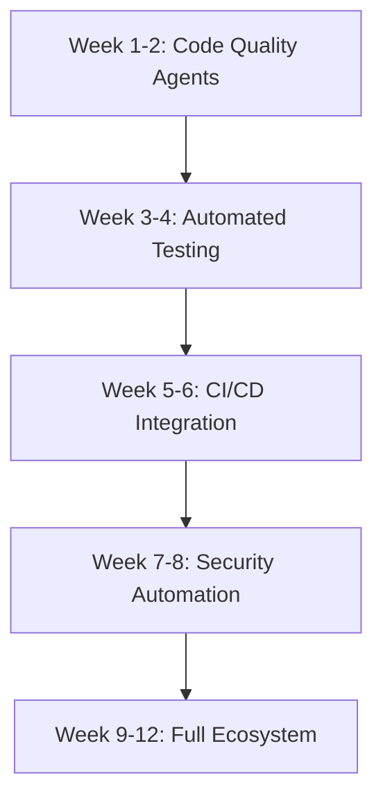

The software development landscape is experiencing a paradigm shift. While we've grown accustomed to AI assistants that complete our code or answer our questions, a new breed of artificial intelligence is emerging—one that doesn't just assist but actively collaborates, plans, and executes complex development tasks autonomously.

Welcome to the era of **Agentic AI**: intelligent systems that act as autonomous team members, capable of understanding goals, making decisions, and executing multi-step workflows without constant human oversight.

In this comprehensive guide, we'll explore how Agentic AI is transforming the software development lifecycle, provide practical implementation strategies, examine real-world case studies, and discuss the profound implications for the future of development teams.

---

## Understanding Agentic AI: Beyond Traditional AI Assistants

### What Makes Agentic AI Different?

**Agentic AI** refers to artificial intelligence systems capable of taking autonomous, goal-driven actions on behalf of users, often executing complex multi-step workflows without requiring step-by-step human intervention. Unlike traditional AI assistants that respond to discrete prompts, agentic systems operate more like collaborative team members—planning, reasoning, and adapting their approach to achieve desired outcomes.

### Key Differentiators from Traditional AI Tools

| Aspect | Traditional AI Assistants | Agentic AI Systems |
|--------|---------------------------|-------------------|
| **Interaction Model** | Respond to single prompts | Operate in continuous workflows |
| **Capability Scope** | Limited to suggestions or completion | Execute actions autonomously |
| **Control Level** | User controls every step | AI decides intermediate steps toward goals |
| **Context Management** | Context reset frequently | Maintain persistent state and long-term memory |
| **Decision Making** | Reactive to user input | Proactive goal-oriented planning |
| **Workflow Integration** | Tool-based assistance | End-to-end process automation |

### The Paradigm Shift in Development

This evolution moves developers from a **"prompt and react"** model to a **"set the goal and supervise"** approach, enabling higher levels of abstraction in software creation. Instead of micromanaging every coding decision, developers can focus on architecture, business logic, and strategic problem-solving while AI agents handle routine implementation tasks.

---

## Practical Agentic AI Integration in Development Workflows

Agentic AI can seamlessly integrate into every stage of the software development lifecycle. Here are practical implementations developers can start using today:

### 1. Autonomous Code Quality Management

#### How It Works

AI agents continuously monitor codebases for quality issues, automatically implementing improvements while ensuring safety through comprehensive testing.

#### Implementation Example

```yaml
# .github/workflows/agentic-refactor.yml
name: Agentic Code Quality Agent
on:
  push:
    branches: [develop]
  schedule:
    - cron: '0 2 * * 1' # Weekly Monday 2 AM

jobs:
  autonomous-refactor:
    runs-on: ubuntu-latest
    steps:
      - uses: actions/checkout@v3
      - name: Run Code Quality Agent
        uses: agentic-ai/code-quality-agent@v1
        with:
          targets: |
            - detect-code-smells
            - remove-dead-code
            - optimize-imports
            - improve-naming
          safety-checks: true
          auto-commit: true
          create-pr: true
```

#### Typical Workflow

1. **Trigger**: Developer pushes to feature branch or scheduled execution
2. **Analysis**: Agent scans repository for code smells, duplication, and anti-patterns
3. **Refactoring**: Implements improvements while maintaining functionality
4. **Validation**: Runs comprehensive test suite to ensure safety
5. **Documentation**: Creates detailed commit messages and change summaries
6. **Review**: Submits pull request for human approval of significant changes

#### Benefits

- **Continuous Quality**: Maintains code health without dedicated manual cycles
- **Technical Debt Reduction**: Prevents accumulation of problematic code patterns
- **Developer Focus**: Frees developers from routine maintenance tasks

### 2. Intelligent Test Generation and Maintenance

#### Advanced Test Strategy Implementation

```typescript
// Example: AI-generated test suite for user authentication
// Generated by Agentic AI based on source code analysis

describe('UserAuthenticationService', () => {
  // Agent-generated edge cases based on code analysis
  describe('Password Validation', () => {
    test('should reject passwords with insufficient entropy', async () => {
      const weakPasswords = [
        '123456', 'password', 'qwerty', 'admin',
        'letmein', 'welcome', '12345678'
      ];
      
      for (const password of weakPasswords) {
        await expect(
          authService.validatePassword(password)
        ).rejects.toThrow('Password does not meet security requirements');
      }
    });

    test('should handle Unicode characters in passwords', async () => {
      const unicodePassword = 'Pässwörd123!@#';
      const result = await authService.validatePassword(unicodePassword);
      expect(result.isValid).toBe(true);
    });

    // Agent identified this edge case from error logs
    test('should prevent timing attacks on password validation', async () => {
      const startTime = Date.now();
      await authService.validatePassword('wrong-password');
      const wrongPasswordTime = Date.now() - startTime;

      const startTime2 = Date.now();
      await authService.validatePassword('a'.repeat(1000));
      const longPasswordTime = Date.now() - startTime2;

      // Timing should be consistent regardless of input
      expect(Math.abs(wrongPasswordTime - longPasswordTime)).toBeLessThan(50);
    });
  });
});
```

#### Integration Points

- **PR Pipeline**: Automatic test generation for new code changes
- **Coverage Analysis**: Intelligent gap identification and test creation
- **Regression Prevention**: Automatic test updates when code changes
- **Performance Testing**: AI-generated load and stress test scenarios

### 3. Intelligent CI/CD Pipeline Orchestration

#### Self-Healing Deployment Pipeline

```python
# Example: Agentic AI pipeline management
class AgenticPipelineOrchestrator:
    def __init__(self):
        self.failure_patterns = MLModel.load('deployment-failure-classifier')
        self.remediation_strategies = ActionLibrary.load()
    
    async def handle_deployment_failure(self, failure_context):
        # AI analyzes failure patterns
        failure_type = await self.classify_failure(failure_context)
        
        # Autonomous decision-making
        if failure_type == 'database_migration_failure':
            return await self.handle_migration_failure(failure_context)
        elif failure_type == 'resource_constraint':
            return await self.scale_resources(failure_context)
        elif failure_type == 'configuration_error':
            return await self.fix_configuration(failure_context)
        
        # Escalate to human if unknown pattern
        return await self.escalate_to_human(failure_context)
    
    async def handle_migration_failure(self, context):
        # Agent creates rollback strategy
        rollback_plan = await self.create_rollback_plan(context)
        
        # Execute rollback
        await self.execute_rollback(rollback_plan)
        
        # Analyze root cause
        root_cause = await self.analyze_migration_logs(context)
        
        # Create fix recommendation
        fix_suggestion = await self.generate_fix_suggestion(root_cause)
        
        # Notify team with actionable insights
        await self.notify_team({
            'status': 'deployment_rolled_back',
            'root_cause': root_cause,
            'suggested_fix': fix_suggestion,
            'estimated_fix_time': '30 minutes'
        })
```

#### Advanced Capabilities

- **Predictive Failure Detection**: AI identifies potential issues before they cause outages
- **Automated Rollback Strategies**: Intelligent decision-making for deployment failures
- **Performance Optimization**: Dynamic resource allocation based on traffic patterns
- **Security Monitoring**: Autonomous threat detection and response

---

## Real-World Success Story: TechCorp's 47% Productivity Boost

### Company Background

**TechCorp**, a fast-growing fintech startup with 85 developers, was facing significant scaling challenges:

- **Release Bottlenecks**: Average 21-day release cycles due to manual testing and quality checks
- **Quality Issues**: 15% of releases required emergency hotfixes within 48 hours
- **Developer Burnout**: 65% of development time spent on maintenance rather than feature work
- **Technical Debt**: Accumulating faster than it could be addressed

### The Agentic AI Transformation Initiative

#### Phase 1: Foundation (Months 1-2)

**Tools Implemented:**

- **Code Quality Agents**: Integrated with GitHub Actions for autonomous refactoring
- **Test Generation AI**: Automated test creation for new features and bug fixes
- **Documentation Bots**: Automatic API documentation and code comment generation

#### Phase 2: Advanced Automation (Months 3-4)

**Expanded Capabilities:**

- **Intelligent CI/CD**: Self-healing pipelines with automated rollback strategies
- **Security Scanning**: Autonomous vulnerability detection and patching
- **Performance Monitoring**: AI-driven optimization recommendations

#### Phase 3: Full Integration (Months 5-6)

**Complete Ecosystem:**

- **Cross-team Coordination**: AI agents managing dependencies across teams
- **Predictive Analytics**: Forecasting potential issues before they impact development
- **Intelligent Resource Management**: Dynamic infrastructure scaling

### Measurable Business Impact

| Metric | Before Implementation | After 6 Months | Improvement |
|--------|----------------------|----------------|-------------|
| **Release Cycle Time** | 21 days | 11 days | **47% faster** |
| **Production Hotfix Rate** | 15% | 4% | **73% reduction** |
| **Code Coverage** | 68% | 89% | **31% increase** |
| **Developer Maintenance Time** | 65% | 28% | **57% reduction** |
| **Mean Time to Recovery (MTTR)** | 4.2 hours | 45 minutes | **82% improvement** |
| **Team Velocity** | 120 story points/sprint | 176 story points/sprint | **47% increase** |
| **Developer Satisfaction Score** | 6.2/10 | 8.4/10 | **35% improvement** |

### Key Success Factors

#### 1. Gradual Adoption Strategy



#### 2. Human-AI Collaboration Framework

- **High-Risk Changes**: Always require human approval
- **Routine Tasks**: Full automation with audit trails
- **Learning Feedback**: Continuous improvement based on developer input

#### 3. Cultural Transformation

- **Training Programs**: Upskilling developers in AI orchestration
- **New Roles**: AI-Development Partnership specialists
- **Metrics Focus**: Shifted from lines of code to business value delivered

---

## Addressing Challenges and Ethical Considerations

### 1. Technical Challenges

#### The Maintainability Problem

**Challenge**: AI-generated code can become opaque and difficult to maintain if not properly documented.

**Solution Strategy**:

```typescript
// AI Agent Configuration for Maintainable Code Generation
const agentConfig = {
  codeGeneration: {
    documentationRequirement: 'mandatory',
    commentDensity: 'high',
    namingConvention: 'descriptive',
    architecturalPatterns: ['clean-architecture', 'solid-principles'],
    testGeneration: 'comprehensive'
  },
  qualityGates: {
    cyclomaticComplexity: { max: 10 },
    functionLength: { max: 50 },
    duplicatedCode: { tolerance: 3 }
  },
  explainability: {
    decisionLogging: true,
    changeRationale: true,
    impactAnalysis: true
  }
};
```

#### Security and Access Control

**Implementation of Least Privilege Principles**:

```yaml
# Agentic AI Security Configuration
agentic_ai_permissions:
  code_quality_agent:
    repositories: ['dev/*', 'staging/*']
    actions: ['read', 'create_branch', 'create_pr']
    restrictions: ['no_direct_main', 'require_approval_for_critical']
  
  deployment_agent:
    environments: ['dev', 'staging']
    actions: ['deploy', 'rollback']
    escalation_triggers:
      - production_deployments
      - data_migrations
      - security_updates
  
  monitoring:
    audit_trail: comprehensive
    anomaly_detection: enabled
    human_oversight: required_for_critical_actions
```

### 2. Ethical and Social Implications

#### Preventing Developer Skill Atrophy

**Strategies for Maintaining Human Expertise**:

1. **Rotation Programs**: Developers regularly work on manual implementation projects
2. **Code Review Requirements**: Human oversight of all AI-generated solutions
3. **Continuous Learning**: Regular training on underlying technologies
4. **Architecture Ownership**: Humans retain control over system design decisions

#### Transparency and Explainability

```python
class ExplainableAgenticAI:
    def generate_code_change(self, requirements):
        # Document decision-making process
        decision_log = {
            'input_analysis': self.analyze_requirements(requirements),
            'pattern_selection': self.select_patterns(requirements),
            'implementation_rationale': self.explain_implementation(),
            'risk_assessment': self.assess_risks(),
            'testing_strategy': self.plan_testing()
        }
        
        # Generate code with full traceability
        code_changes = self.implement_solution(requirements)
        
        return {
            'changes': code_changes,
            'explanation': decision_log,
            'confidence_score': self.calculate_confidence(),
            'human_review_required': self.requires_human_review()
        }
```

---

## The Future of AI-Augmented Development Teams

### Emerging Trends and Technologies

#### 1. Multi-Agent Collaborative Systems

The future will see specialized AI agents working together:

- **Architect Agent**: Designs system architecture and makes technology decisions
- **Implementation Agent**: Writes code and handles routine development tasks
- **QA Agent**: Develops comprehensive testing strategies and quality assurance
- **DevOps Agent**: Manages infrastructure and deployment pipelines
- **Security Agent**: Identifies vulnerabilities and implements security measures

#### 2. Natural Language Programming

```python
# Future: Natural language to production code
def create_user_management_system():
    """
    Create a secure user management system with the following requirements:
    - User registration with email verification
    - Password reset functionality with secure tokens
    - Role-based access control with admin and user roles
    - API rate limiting to prevent abuse
    - GDPR-compliant data handling
    - Integration with OAuth providers (Google, GitHub)
    """
    # AI Agent automatically implements all requirements
    return AgenticAI.implement_from_specification(__doc__)
```

#### 3. Predictive Development Analytics

AI systems will anticipate development needs:

- **Capacity Planning**: Predicting team scaling requirements
- **Technology Adoption**: Recommending optimal tool and framework choices
- **Risk Assessment**: Identifying potential project bottlenecks before they occur

### Evolving Developer Roles

#### The AI-Augmented Developer Profile

**Core Competencies for 2025 and Beyond:**

1. **AI Orchestration Skills**
   - Prompt engineering for development tasks
   - Agent configuration and customization
   - Multi-agent system design

2. **Strategic Thinking**
   - Business logic architecture
   - System design and scalability planning
   - Technology strategy and roadmapping

3. **Quality Governance**
   - AI output review and validation
   - Establishing development standards
   - Risk assessment and mitigation

4. **Human-AI Collaboration**
   - Effective communication with AI systems
   - Continuous learning and adaptation
   - Ethical AI implementation

---

## Conclusion: Embracing the Agentic AI Revolution

Agentic AI represents more than just another productivity tool—it's a fundamental shift in how we approach software development. As we've seen through real-world case studies and practical implementations, organizations adopting these technologies are seeing dramatic improvements in productivity, quality, and developer satisfaction.

### Key Takeaways

1. **Start Small, Scale Gradually**: Begin with simple automation and progressively add intelligence
2. **Maintain Human Oversight**: AI should augment, not replace, human decision-making
3. **Focus on Value Creation**: Use AI to eliminate repetitive tasks and enable creative problem-solving
4. **Invest in Learning**: The future belongs to developers who can effectively collaborate with AI systems
5. **Prepare for Change**: The role of software developers will evolve significantly in the next 3-5 years

### The Bottom Line

**Agentic AI won't make developers obsolete—it will elevate their impact.** By freeing developers from low-value, repetitive tasks, these systems enable focus on what humans do best: creative problem-solving, strategic thinking, and innovative system design.

The organizations and developers who embrace this transformation early will have a significant competitive advantage. The question isn't whether Agentic AI will reshape software development—it's whether you'll be leading the change or catching up to it.

**Ready to begin your Agentic AI journey?** Start with one small automation project and gradually expand your capabilities. The future of development is here, and it's more exciting than ever.

---

*Want to stay updated on the latest developments in AI-augmented software development? Follow my blog for in-depth analyses, practical tutorials, and insights from the frontlines of the AI revolution in tech.*
